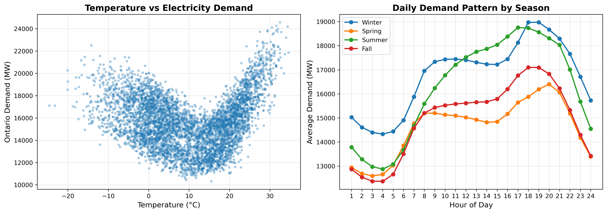

# Ontario Electricity Demand Forecasting with Machine Learning

[](https://www.python.org/)
[](https://scikit-learn.org/)
[](https://xgboost.readthedocs.io/)
[](https://opensource.org/licenses/MIT)

A comprehensive machine learning project for short-term hourly electricity demand forecasting in Ontario, Canada. Achieved **50.7% RMSE improvement** over baseline using a Multi-Layer Perceptron Neural Network.

<p align="center">
  
</p>

## Key Results

| Model | Test RMSE (MW) | R² Score | Improvement | Training Time |
|-------|----------------|----------|-------------|---------------|
| **Neural Network** | **203.92** | **0.9928** | **50.7%** | 185.1s |
| XGBoost | 222.86 | 0.9914 | 46.1% | 2.7s |
| Random Forest | 321.30 | 0.9821 | 22.3% | 6.9s |
| Linear Regression | 413.25 | 0.9704 | baseline | 0.5s |
| SVR (RBF Kernel) | 476.05 | 0.9607 | -15.2% | 570.2s |

<p align="center">
  
</p>

## Project Overview

### Problem
Electricity grid operators need accurate demand forecasts to:
- Balance supply and demand in real-time
- Prevent blackouts from underestimation
- Minimize costs from overgeneration

Ontario presents a unique challenge due to its **U-shaped temperature-demand relationship** — electricity consumption increases at both cold temperatures (heating) and hot temperatures (air conditioning).

### Solution
We developed a machine learning pipeline that:
1. Integrates data from 4 sources (109,056 hourly records, 2013-2025)
2. Engineers 13 specialized features capturing temporal patterns and nonlinear weather effects
3. Compares 5 ML models from simple linear regression to state-of-the-art gradient boosting
4. Achieves 50.7% error reduction with a 3-layer Neural Network

## Repository Structure

```
├── notebooks/
│   ├── 01_Load_IESO_Data.ipynb          # Load electricity demand data
│   ├── 02_Download_Weather_Data.ipynb    # Environment Canada weather
│   ├── 03_Merge_IESO_Weather.ipynb       # Data integration
│   ├── 05_Load_IESO_Prices.ipynb         # Electricity prices (HOEP)
│   ├── 06_Download_NASA_Solar.ipynb      # NASA POWER solar irradiance
│   ├── 07_Generate_Holiday_Features.ipynb # Ontario statutory holidays
│   ├── 08_Feature_Engineering.ipynb      # Lag, degree days, cyclical features
│   ├── 09_Enhanced_Data_Merging.ipynb    # Final dataset assembly
│   ├── 10_Linear_Regression.ipynb        # Baseline model
│   ├── 11_Support_Vector_Regression.ipynb # SVR with RBF kernel
│   ├── 12_Neural_Network.ipynb           # MLP (best model)
│   ├── 13_Random_Forest.ipynb            # Ensemble method
│   ├── 14_XGBoost.ipynb                  # Gradient boosting
│   └── 15_Final_Model_Comparison.ipynb   # Comprehensive evaluation
├── report/
│   ├── ECE1513H_Group14_FinalReport.pdf  # IEEE-format technical report
│   └── figures/                          # Visualizations
├── results/
│   └── model_comparison.csv              # Performance metrics
└── README.md
```

## Feature Engineering

We engineered 13 features from raw data, expanding from 17 to 31 total features:

| Category | Features | Purpose |
|----------|----------|---------|
| **Lag Variables** | `Demand_Lag_1h`, `Demand_Lag_24h`, `Demand_Lag_168h` | Capture temporal autocorrelation |
| **Rolling Averages** | `RollingAvg_24h`, `RollingAvg_168h` | Smooth noise, preserve trends |
| **Degree Days** | `HDD`, `CDD` (base 18°C) | Industry-standard HVAC demand metrics |
| **Temperature** | `Temp_Squared`, `Temp_x_Hour` | Model U-shaped nonlinear relationship |
| **Cyclical Encoding** | `Hour_Sin`, `Hour_Cos`, `Month_Sin`, `Month_Cos` | Preserve circular time patterns |

<p align="center">
  
</p>

**Key Finding:** `Demand_Lag_1h` dominates with importance score of 1.587 — the best predictor of current demand is recent demand. `Temp_Squared` ranks second (0.55), validating our U-shaped hypothesis.

## Data Sources

| Source | Data | Records | Period |
|--------|------|---------|--------|
| [IESO](https://www.ieso.ca/en/Power-Data/Data-Directory) | Hourly Ontario electricity demand (MW) | 109,056 | 2013-2025 |
| [Environment Canada](https://climate.weather.gc.ca/) | Weather observations (Toronto Pearson) | 109,056 | 2013-2025 |
| [NASA POWER](https://power.larc.nasa.gov/) | Solar irradiance (GHI, DNI, DHI) | 4,563 days | 2013-2025 |
| [Python holidays](https://pypi.org/project/holidays/) | Ontario statutory holidays | 118 days | 2013-2025 |

## Model Architectures

### Neural Network (Best Model)
```
Input Layer (31 features)
    ↓
Hidden Layer 1: 128 neurons, ReLU
    ↓
Hidden Layer 2: 64 neurons, ReLU
    ↓
Hidden Layer 3: 32 neurons, ReLU
    ↓
Output Layer: 1 neuron (demand prediction)
```

**Hyperparameters:**
- Optimizer: Adam (learning rate: 0.001, adaptive)
- Regularization: L2 (α = 0.0001)
- Early stopping: patience = 10 epochs
- Converged at iteration 102

### Why SVR Failed
Despite its theoretical nonlinear capability, SVR performed **worse than linear regression** (-15.2%). The O(n²) to O(n³) computational complexity overwhelmed the optimizer with 83,000+ training samples, producing a suboptimal solution even after 570 seconds of training.

<p align="center">
  
</p>

## Quick Start

### Prerequisites
```bash
pip install pandas numpy scikit-learn xgboost matplotlib seaborn holidays
```

### Run the Pipeline
```bash
# 1. Data collection (requires internet)
jupyter notebook notebooks/01_Load_IESO_Data.ipynb
jupyter notebook notebooks/02_Download_Weather_Data.ipynb
# ... run notebooks 03-09 for data preparation

# 2. Model training
jupyter notebook notebooks/12_Neural_Network.ipynb  # Best model

# 3. Full comparison
jupyter notebook notebooks/15_Final_Model_Comparison.ipynb
```

## Technical Report

The full IEEE-format technical report is available at [`report/ECE1513H_Group14_FinalReport.pdf`](report/ECE1513H_Group14_FinalReport.pdf).

**Sections:**
- Abstract & Introduction
- System Design (data sources, feature engineering, model selection)
- Results (performance comparison, feature importance, error analysis)
- Concluding Remarks & Future Work

## Skills Demonstrated

- **Machine Learning:** Regression, Neural Networks, SVMs, Ensemble Methods, Gradient Boosting
- **Data Engineering:** Multi-source data integration, feature engineering, time series processing
- **Python:** pandas, NumPy, scikit-learn, XGBoost, Matplotlib, Seaborn
- **APIs:** Environment Canada, NASA POWER, IESO public data
- **Technical Writing:** IEEE-format academic report, data visualization

## Team

- **Nabeegh Khan** — Data collection, feature engineering, model implementation, report writing
- Artem Arutyunov — Project review
- Selim Akef — Project review

*University of Toronto — ECE1513H: Introduction to Machine Learning (Fall 2025)*

## License

This project is licensed under the MIT License - see the [LICENSE](LICENSE) file for details.

## Acknowledgments

- Professor and teaching team of ECE1513H
- [IESO](https://www.ieso.ca/) for public electricity data
- [Environment Canada](https://climate.weather.gc.ca/) for weather data
- [NASA POWER](https://power.larc.nasa.gov/) for solar irradiance data
