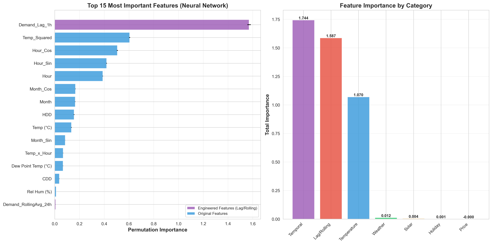
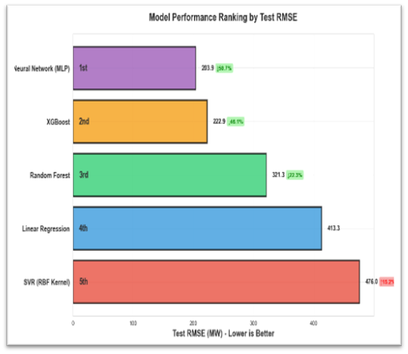
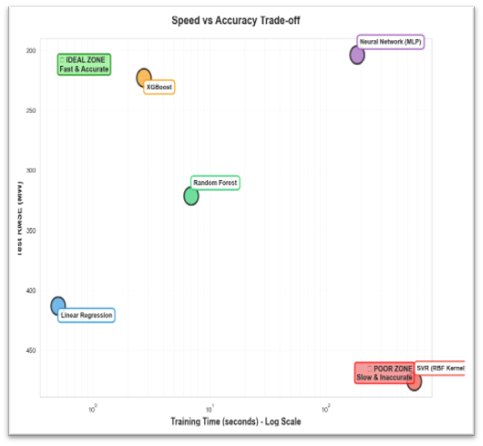

# Ontario electricity demand forecasting

Short-term (next-hour) forecasting of Ontario electricity demand from weather, calendar, and recent-demand features. Course project for ECE1513H (Introduction to Machine Learning), University of Toronto, Fall 2025.

**TL;DR.** Across five models on 109,056 hourly records (2013–2025), a 3-layer neural network gives the lowest test RMSE (203.92 MW), a 50.7% reduction over the linear-regression baseline. One honest caveat up front: last-hour demand is a feature, and demand is highly autocorrelated, so all the models score high R² partly because next-hour demand is close to this-hour demand (see Limitations).

## Problem

Grid operators need accurate short-term demand forecasts to balance supply and demand, avoid shortfalls, and avoid the cost of over-generating. Ontario has a U-shaped temperature-demand curve: demand rises in the cold (heating) and in the heat (air conditioning), so the weather relationship is nonlinear.

## Data

Four public sources, merged to hourly resolution (2013–2025):

| Source | Data | Records |
|---|---|---|
| [IESO](https://www.ieso.ca/en/Power-Data/Data-Directory) | Hourly Ontario demand (MW) | 109,056 |
| [Environment Canada](https://climate.weather.gc.ca/) | Weather (Toronto Pearson) | 109,056 |
| [NASA POWER](https://power.larc.nasa.gov/) | Solar irradiance (GHI, DNI, DHI) | 4,563 days |
| [python-holidays](https://pypi.org/project/holidays/) | Ontario statutory holidays | 118 days |

## Approach

**Feature engineering** (13 features added, 17 → 31 total):

| Category | Features | Why |
|---|---|---|
| Lag | `Demand_Lag_1h`, `_24h`, `_168h` | temporal autocorrelation |
| Rolling averages | `RollingAvg_24h`, `_168h` | smooth noise, keep trend |
| Degree days | `HDD`, `CDD` (base 18°C) | standard HVAC-demand metric |
| Temperature | `Temp_Squared`, `Temp_x_Hour` | the U-shaped nonlinearity |
| Cyclical | `Hour_Sin/Cos`, `Month_Sin/Cos` | circular time encoding |


*`Demand_Lag_1h` dominates (importance 1.587): recent demand is the best predictor of current demand. `Temp_Squared` is second (0.55), which supports the U-shaped hypothesis.*

**Models.** Linear regression (baseline), SVR (RBF), Random Forest, XGBoost, and a 3-layer MLP (128 → 64 → 32, ReLU; Adam lr=0.001, L2 α=1e-4, early stopping, converged at iteration 102).

## Results

| Model | Test RMSE (MW) | R² | vs baseline | Train time |
|---|---|---|---|---|
| **Neural network** | **203.92** | **0.9928** | **−50.7%** | 185.1s |
| XGBoost | 222.86 | 0.9914 | −46.1% | 2.7s |
| Random Forest | 321.30 | 0.9821 | −22.3% | 6.9s |
| Linear regression | 413.25 | 0.9704 | baseline | 0.5s |
| SVR (RBF) | 476.05 | 0.9607 | +15.2% | 570.2s |



The neural network wins on accuracy but costs ~70× the training time of XGBoost, which is within 9% of it. For most practical purposes XGBoost is the better trade-off.

**Why SVR does worst.** Despite being a nonlinear method, SVR scored below linear regression. RBF-kernel SVR scales roughly O(n²)–O(n³), and with 83,000+ training samples the optimizer didn't reach a good solution even after 570 seconds. It's the wrong tool at this data size.



## Reproduce

```bash
pip install pandas numpy scikit-learn xgboost matplotlib seaborn holidays
# data collection (needs internet): notebooks 01–09
# best model: notebook 12 (neural network)
# full comparison: notebook 15
```

```
├── notebooks/     01–09 data, 10–14 models, 15 comparison
├── report/        IEEE-format report + figures
├── results/       model_comparison.csv
└── README.md
```

## Limitations and next steps

- **No persistence baseline.** The strongest predictor is last-hour demand, and demand is highly autocorrelated, so high R² is partly built in. The honest baseline to beat is a naive "next hour = this hour" persistence forecast, not linear regression. I'd add that comparison before making strong claims about model quality; the RMSE differences between models are the more meaningful signal here.
- **One weather station.** Weather comes from Toronto Pearson only, standing in for all of Ontario, which loses regional variation.
- **Chronological single split.** Results are from one train/test split, not walk-forward or rolling-origin cross-validation, which is the standard for time-series forecasting.
- **Solar and holiday coverage is coarser** than the hourly demand and weather series, so those features are lower-resolution.

## Contributors

Group project for ECE1513H (University of Toronto, Fall 2025). Nabeegh Khan: data collection, feature engineering, model implementation, and report writing. Artem Arutyunov and Selim Akef: review. The full IEEE-format report is in `report/`.
